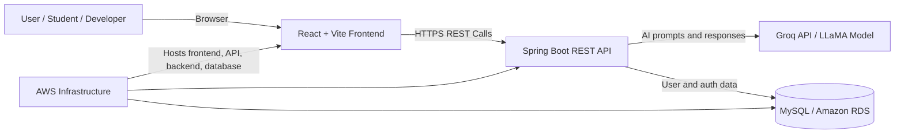
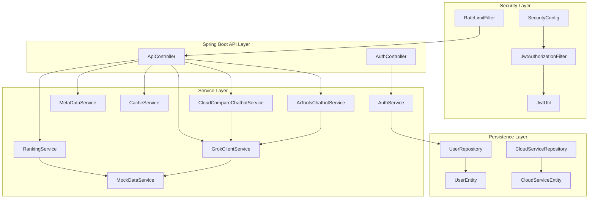
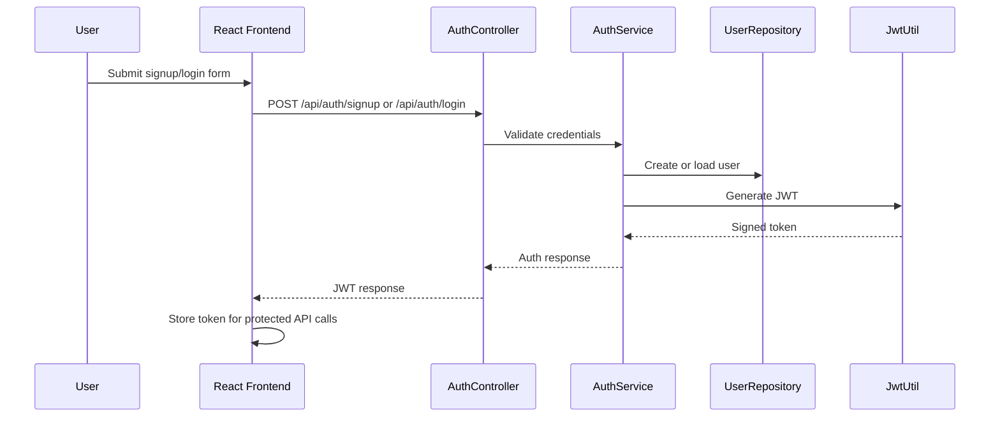
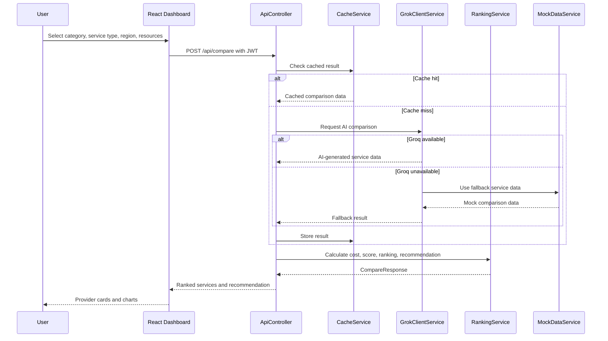
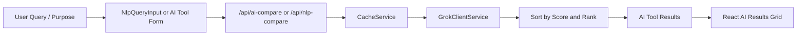
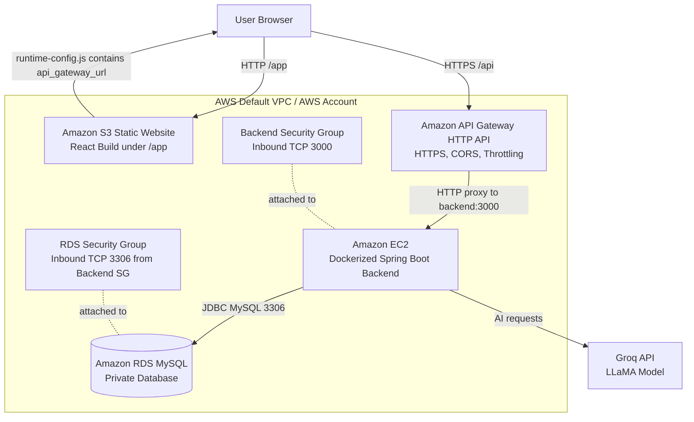
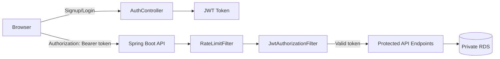

# CloudCompare AI Architecture

## Overview

CloudCompare AI is a full-stack cloud comparison and recommendation platform. It uses a React frontend, Spring Boot REST API, Groq/LLaMA-based AI recommendation layer, JWT security, MySQL/RDS persistence, and Terraform-managed AWS infrastructure.

The architecture is designed around four goals:

- Provide a simple web dashboard for cloud and AI tool comparison.
- Protect user and recommendation APIs with JWT authentication.
- Use AI-assisted ranking while keeping fallback behavior available.
- Deploy reproducibly on AWS using S3, API Gateway, EC2, RDS, and security groups.

## High-Level System Context

## Application Layers

| Layer | Main Components | Responsibility |
|---|---|---|
| Presentation | React, Vite, Axios, Chart.js | Dashboard UI, authentication screens, cloud comparison forms, AI tool cards, charts |
| API | `ApiController`, `AuthController` | Exposes REST endpoints for auth, comparison, NLP, AI tools, chatbot, metadata |
| Security | Spring Security, JWT filters, `JwtUtil` | Login/signup security, token generation, token validation, protected routes |
| Business Services | `RankingService`, `MetaDataService`, chatbot services | Ranking, provider metadata, recommendation shaping, chatbot responses |
| AI Integration | `GrokClientService`, `MockDataService` | Groq/LLaMA requests, fallback data, response parsing, AI tool comparison |
| Reliability | `CacheService`, Resilience4j, `RateLimitFilter`, `GlobalExceptionHandler` | Caching, retry/circuit breaker, API protection, consistent error handling |
| Persistence | Spring Data JPA, MySQL/RDS, H2 for local/test | User credentials and persistence support |
| Infrastructure | Terraform, S3, API Gateway, EC2, RDS, security groups | Production provisioning and deployment |

## Backend Component Architecture

## Main Request Flows

### Authentication Flow

### Cloud Comparison Flow

### AI Tools and NLP Flow

## AWS Deployment Architecture

## Infrastructure Provisioning

Terraform in `iac/terraform/` provisions:

- Amazon S3 bucket for React static website hosting.
- Amazon API Gateway HTTP API for managed API access, CORS, HTTPS endpoint, and throttling.
- Amazon EC2 instance for the Dockerized Spring Boot backend.
- Amazon RDS MySQL database for production user data.
- Security groups for backend traffic and private database access.
- Runtime frontend configuration that points the browser to `api_gateway_url`.

Key Terraform files:

| File | Purpose |
|---|---|
| `main.tf` | AWS resources, API Gateway, EC2, RDS, S3, runtime config |
| `variables.tf` | Deployment variables, secrets, throttling settings |
| `outputs.tf` | `frontend_url`, `api_gateway_url`, `backend_url`, `rds_endpoint` |

## Security Architecture

Security controls:

- JWT-based stateless authentication.
- Public signup, login, and health-check endpoints.
- Protected comparison, AI, NLP, region, service-type, and chatbot endpoints.
- Rate limiting before API processing.
- Centralized exception handling.
- Private RDS database access restricted to the backend security group.
- Terraform variables for secrets such as database password, Groq API key, and JWT secret.

## Reliability and Performance

| Concern | Implementation |
|---|---|
| AI API failure | `GrokClientService` includes fallback behavior through `MockDataService` |
| External call resilience | Resilience4j retry and circuit breaker configuration |
| Repeated comparison requests | Caffeine-backed `CacheService` |
| API abuse | `RateLimitFilter` |
| Consistent errors | `GlobalExceptionHandler` |
| Runtime efficiency | Java 21, virtual threads, gzip compression |
| Deployment repeatability | Terraform and Docker |

## Data and Recommendation Model

The comparison pipeline uses structured request and response DTOs:

- `CompareRequest` captures category, service type, resource needs, region, priority, and usage hours.
- `CompareResponse` returns filters, total results, provider statistics, ranked services, and one recommendation.
- `ServiceResult` stores provider/service details, price fields, performance/popularity scores, calculated cost, score, rank, and recommendation reason.
- `AiToolResult` stores AI tool recommendations for AI tools and natural language query flows.

Ranking uses provider data from Groq or fallback data, then calculates cost and score through `RankingService`.

## Design Decisions

| Decision | Reason |
|---|---|
| Spring Boot as the single backend | The implemented backend is Java/Spring-based and provides strong structure for controllers, services, security, JPA, and testing |
| Direct Groq/LLaMA integration | The current implementation integrates directly with the Groq API and keeps the AI layer simple, testable, and verifiable |
| API Gateway in front of EC2 | Adds managed HTTPS entrypoint, CORS handling, request routing, and throttling |
| RDS private database | Keeps production user data away from direct public access |
| H2 for local/test | Simplifies local development and automated tests |
| Terraform for AWS | Makes infrastructure reproducible and easier to review |
| Mock fallback data | Keeps core comparison flows usable when AI provider calls fail |

## Future Architecture Enhancements

- Integrate official AWS, Azure, and GCP pricing APIs.
- Add a migration recommendation service.
- Add a security and compliance advisory module.
- Expand React analytics beyond basic bar charts.
- Add saved comparison history and multi-user workspaces.
- Add CloudFront in front of S3 for frontend HTTPS and CDN caching.
- Add AWS Secrets Manager or SSM Parameter Store for production secrets.
- Add observability with logs, metrics, alarms, and deployment smoke tests.
