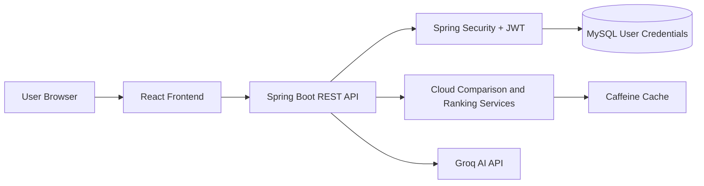
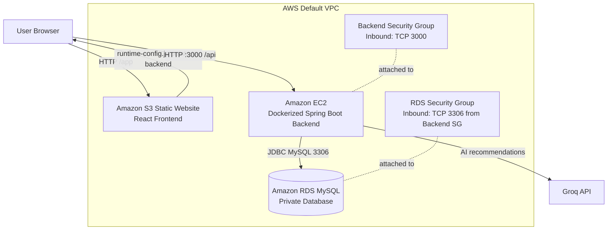
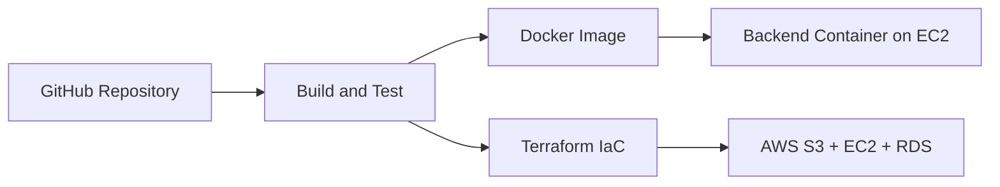

# CloudCompare AI

[](https://openjdk.org)
[](https://spring.io/projects/spring-boot)
[](https://react.dev)
[](https://aws.amazon.com)
[](https://www.terraform.io)
[](https://jenkins.io)
[](https://sonarqube.org)
[](https://docker.com)
[](https://github.com/raghavendra2006/CLOUD-COMPARE-AI)
[](LICENSE)

CloudCompare AI is a full-stack multi-cloud comparison and recommendation platform that helps users evaluate cloud infrastructure services across AWS, Azure, Google Cloud Platform (GCP), Oracle Cloud Infrastructure (OCI), and Alibaba Cloud.

The platform analyzes cloud resources such as compute, storage, pricing, and regional availability to generate intelligent recommendations based on cost, performance, and optimization priorities.

The production deployment uses a React frontend hosted on Amazon S3, a Dockerized Spring Boot backend running on Amazon EC2, and a private Amazon RDS MySQL database for secure user credential storage.

**Topics:** `spring-boot`, `react`, `terraform`, `aws-s3`, `aws-ec2`, `amazon-rds`, `docker`, `jenkins`, `multi-cloud`, `ai`, `groq`, `java-21`

---

# Quick Start

The fastest way to run CloudCompare AI locally is via Docker Compose:

```bash
# 1. Clone the repository
git clone https://github.com/raghavendra2006/CLOUD-COMPARE-AI.git
cd CLOUD-COMPARE-AI

# 2. Configure .env (see Environment Variables section)

# 3. Start the application
docker-compose up -d --build
```
The platform will be available at `http://localhost:5000`.

---

# Production Deployment on AWS

CloudCompare AI is provisioned with Terraform and deployed into the default AWS VPC.

| Layer | AWS Service | Purpose |
|---|---|---|
| Frontend | Amazon S3 Static Website Hosting | Hosts the React production build under `/app/` |
| Backend | Amazon EC2 | Runs the Spring Boot API as a Docker container |
| Database | Amazon RDS for MySQL | Stores user credentials and authentication data |
| Networking | Default VPC + Security Groups | Controls public backend access and private database access |
| Infrastructure | Terraform | Provisions and updates cloud resources reproducibly |

Deployment characteristics:
- The frontend is publicly served from S3.
- The browser reads a Terraform-generated runtime config that points it to the active backend EC2 public IP.
- The backend accepts API traffic on port `3000`.
- RDS is not publicly accessible.
- MySQL access is restricted to the backend security group.
- Sensitive values are supplied through Terraform variables or environment variables.
- EC2 user data starts Docker and runs the backend container with RDS, JWT, Groq, and CORS configuration.

Production outputs:

| Output | Value |
|---|---|
| Frontend URL | `http://cloudcompare-frontend-d131de99.s3-website-us-east-1.amazonaws.com/app/` |
| Backend URL | `http://54.92.130.156:3000` |
| RDS Endpoint | `cloudcompare-db.cij2e4mu0e71.us-east-1.rds.amazonaws.com:3306` |

---

# Features

- Multi-cloud infrastructure comparison
- AI-assisted recommendation engine using Groq + Llama 3.1
- Cost and performance analysis
- Region-wise cloud comparison
- Interactive analytics dashboard
- JWT-based authentication and authorization
- RESTful API architecture
- Dockerized deployment
- Jenkins CI/CD integration
- Terraform-based AWS infrastructure
- S3-hosted React frontend
- EC2-hosted Spring Boot backend
- Private RDS MySQL credential storage
- SonarQube static code analysis
- Rate limiting and centralized exception handling

---

# Architecture

## High-Level Application Design



## AWS Deployment Architecture



## DevOps Flow



---

# Tech Stack

| Layer | Technologies |
|---|---|
| Frontend | React, Vite, Axios, Chart.js |
| Backend | Java 21, Spring Boot 3.2.5, Spring Web |
| Security | Spring Security, JWT, Rate Limiting |
| Database | Amazon RDS MySQL (Production), H2 (Local/Test) |
| ORM | Spring Data JPA, Hibernate 6 |
| AI Integration | Groq API, Llama 3.1 |
| Branding | Enterprise Local Assets (Oracle OCI, AWS, GCP, Azure) |
| Infrastructure | Terraform, AWS S3, EC2, RDS, Security Groups |
| DevOps | Jenkins, Docker, SonarQube |
| Testing | JUnit 5, Mockito, JaCoCo (87%+ Coverage) |

---

# Project Structure

```text
cloudcompare-ai/
│
├── cloudcompare-frontend/
│   ├── src/
│   └── dist/
│
├── iac/
│   └── terraform/
│       ├── main.tf
│       ├── variables.tf
│       ├── outputs.tf
│       └── README.md
│
├── src/
│   ├── main/
│   │   ├── java/
│   │   ├── resources/
│   │   └── static/
│   │
│   └── test/
│
├── docker/
├── docs/
├── screenshots/
├── .env.example
├── Dockerfile
├── docker-compose.yml
├── pom.xml
└── README.md
```

---

# Security Features

- JWT-based stateless authentication
- Protected API endpoints
- Secure environment variable configuration
- RDS MySQL is private and not directly exposed to the internet
- Database security group allows MySQL only from the backend EC2 security group
- Terraform variables are used for AWS credentials, database password, Groq API key, and JWT secret
- Frontend uses runtime configuration rather than hardcoding backend URLs into source code
- Centralized exception handling
- Rate limiting for API abuse prevention
- Restricted CORS configuration

---

# Performance & Reliability

- Java Virtual Threads (Project Loom)
- Caffeine caching
- GZIP compression
- Optimized REST API responses
- Resilience4J circuit breaker integration

---

# Core Functionalities

## Cloud Comparison

Compare services across:
- AWS
- Azure
- GCP
- OCI
- Alibaba Cloud

Comparison parameters:
- vCPUs
- RAM
- Storage
- Region
- Pricing
- Performance score

---

## AI Recommendation Engine

The AI recommendation engine analyzes your input and returns curated suggestions.

**Example Use Case:**
* **Input:** *"Compare AWS RDS vs GCP Cloud SQL vs Azure SQL for a 500GB OLTP workload"*
* **Output:** The platform leverages Groq (Llama 3.1) to return the top 5 matching database services, ranked by a calculated score, alongside live pricing estimates, model capabilities, and specific architectural justifications tailored to your exact workload.

Features include:
- Analyzes infrastructure requirements
- Evaluates provider pricing
- Calculates ranking scores
- Suggests optimized cloud providers
- Generates AI-assisted recommendations

---

## Dashboard Analytics

Dashboard includes:
- Cost comparison charts
- Performance analysis graphs
- Ranking visualization
- Region-based insights
- Optimization recommendations

---

# API Endpoints

| Method | Endpoint | Description | Authentication |
|---|---|---|---|
| POST | `/api/auth/signup` | Register new user | Public |
| POST | `/api/auth/login` | User login | Public |
| GET | `/api/test` | Health check API | Public |
| POST | `/api/compare` | Compare cloud services | JWT Required |
| POST | `/api/ai-compare` | AI-powered recommendations | JWT Required |
| POST | `/api/nlp-compare` | Natural language AI tool comparison | JWT Required |
| GET | `/api/regions` | Fetch provider regions | JWT Required |

---

# Sample API Request

## Compare Cloud Services

```json
POST /api/compare

{
  "provider": "AWS",
  "vcpu": 4,
  "ram": 16,
  "storage": 200,
  "region": "ap-south-1",
  "priority": "cost"
}
```

---

# Sample API Response

```json
{
  "recommendedProvider": "AWS",
  "estimatedMonthlyCost": 82.45,
  "performanceScore": 91,
  "optimization": "Best balance between cost and performance"
}
```

---

# Environment Variables

Create a `.env` file:

```env
# AI Configuration
GROK_API_KEYS=your_groq_api_key

# Security
JWT_SECRET=your_jwt_secret

# Database (Production)
DB_HOST=your_db_host
DB_NAME=cloudcompare
DB_USER=root
DB_PASSWORD=your_password
```

Terraform deployment secrets should be provided through `TF_VAR_*` environment variables or a local uncommitted `terraform.tfvars` file:

```bash
export TF_VAR_aws_access_key_id="..."
export TF_VAR_aws_secret_access_key="..."
export TF_VAR_db_password="..."
export TF_VAR_groq_api_key="..."
export TF_VAR_jwt_secret="..."
```

### Jenkins Credentials Required
- `ec2-pem-key`: SSH Private Key for EC2 access.
- `dockerhubcred`: Username/Password for Docker Hub registry.
- `GROK_API_KEY_SECRET`: Secret Text for AI Engine connectivity.

---

# Testing

Run unit and integration tests:

```bash
./mvnw test
```

Generate JaCoCo coverage report:

```bash
./mvnw jacoco:report
```

---

# UI & Dashboard

The platform includes a responsive dashboard, authentication flow, AI comparison cards, and interactive Chart.js visualizations for cloud service analysis.

To see the interactive dashboard, charts, and AI comparison cards in action, simply run the application locally or via the Quick Start guide. 

*(Screenshots can be added to the `screenshots/` directory)*

---

# Troubleshooting

| Issue | Cause | Solution |
|---|---|---|
| 429 Too Many Requests | Rate limit exceeded | Wait before retrying |
| Invalid JWT Token | Token expired | Login again |
| MySQL Connection Failed | Database unavailable | Verify DB service |
| Groq API Error | Invalid API key | Check `.env` configuration |

---

# Future Enhancements

- Kubernetes deployment support
- Real-time cloud pricing APIs
- CloudFront and HTTPS support for the S3 frontend
- Managed secrets through AWS Secrets Manager or SSM Parameter Store
- AI chatbot assistant
- Multi-user collaboration
- Advanced cloud cost prediction
- Carbon footprint estimation

---

# Contributing

We welcome contributions! Please see our [CONTRIBUTING.md](CONTRIBUTING.md) for detailed guidelines on how to submit issues, use templates, and create pull requests.

1. Fork the repository
2. Create a feature branch (`git checkout -b feature/AmazingFeature`)
3. Commit changes (`git commit -m 'Add some AmazingFeature'`)
4. Push to the branch (`git push origin feature/AmazingFeature`)
5. Open a Pull Request

---

# License

This project is licensed under the MIT License.

---

# Author

Developed by Raghavendra

GitHub:
https://github.com/raghavendra2006

---

# Live Deployment

Frontend URL: `http://cloudcompare-frontend-d131de99.s3-website-us-east-1.amazonaws.com/app/`

Backend URL: `http://54.92.130.156:3000`
